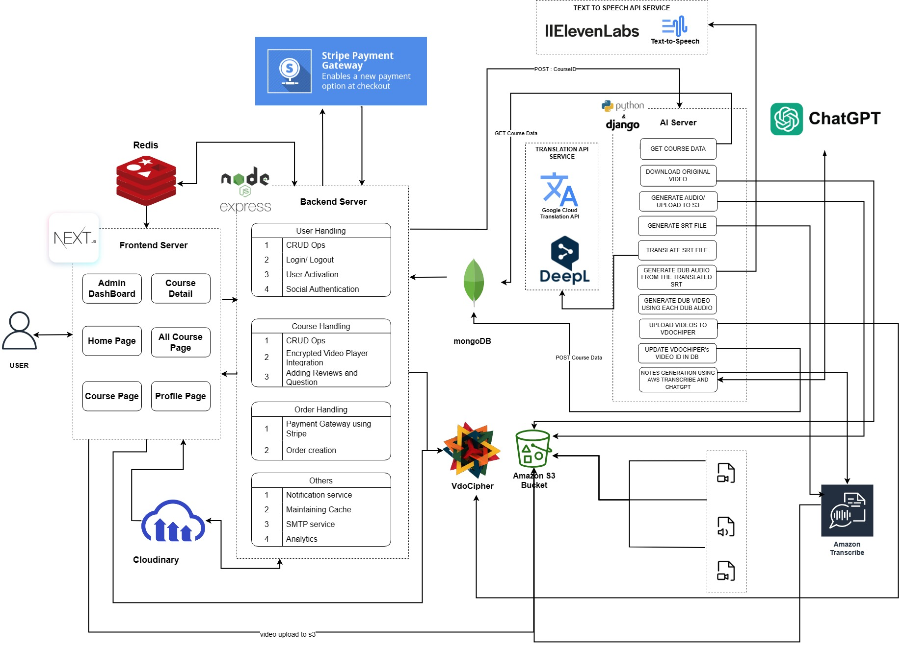

# GlobalLearn
#### A Modern Learning-Management-System
## Team Members
|Name|Email|Institute ID|Role|
|----|-----|-------|-----|
| [Prakash Agarwal](https://github.com/prakash02dec) | prakash02dec@gmail.com |20bcs099| Backend |
| [Prathamesh P Pai](https://github.com/prathamesh-pai) | pratham_71@outlook.com |20bcs103| Backend + Frontend |
| [Sudeepto Chatterjee](https://github.com/sudeepto147) | sudeepto11032001@gmail.com |20bcs130| Frontend |


## Project Architecture
- Frontend server to interact with user
- Backend server to implement the bussiness logics
- AI server to handle all heavy AI powered asyncernous task



## Project Objectives
* Develop Next gen AI integrated LMS Platform.
* Provide courses in multiple language
* Auto notes generation and quiz creation

## Project Setup
Setup the .env file using env_example for respective server.
#### Frontend Server (Nodejs v20.10.0)
<i>for development</i>

```
npm i
npm run dev
```
<i>for Production</i>

```
npm run build
npm start
```
### Backend Server (Nodejs v20.10.0)
<i>for development</i>

```
npm i
npm run dev
```
<i>for Production</i>

```
npm run build
npm start
```

### AI Server (Python 3.11 || Python 3.9)
<i>for development ,initially create virtual environment </i>
```
pip install virtualenv
virtualenv venv
```
<i>if unix/linux</i>
```
source venv/bin/activate
```
<i>if windows</i>
```
venv/Scripts/activate
```
<i>Below steps are common</i>
```
pip install -r requirements.txt
python manage.py runserver 0.0.0.0:5000
```

## Project Planning
* authentication system
	- signUp
	- login
	- Update
	- social authentication
	- refresh token + access token for authentication
	- Profile Page
	- Banned user
* User Friendly Layout Update ( from admi n Portal)
	- Update front page Banner
	- Update FAQ
	- Admin can update Course and Course Category
* Courses
	- CRUD
* Admin Dashboard
	- Analytics
	- Orders and Invoices
* Notification System
* Maintaining Cache (frontend + backend)
* AI Video Dubbing
* Using AI, Notes Generation
* Using AI, Quiz Creation ( Tentative  Feature )


## Future Scopes
* Auto Merging Similar Question and Give Answer in EveryScopes using GenAI
* Voice Cloning using ElevenLabs API
* Multiple Voice Detection and Its voice cloning
* Extraction of background Track
* Reducing overlap by reducing literal Tranlation

<br><br><br>
##### Current Bugs and Issue
* Currently Demo video is configure yet as it not been accepted
* AWS SDK at client server has security issue as we need to set up AWS-sdk server side of next js.


